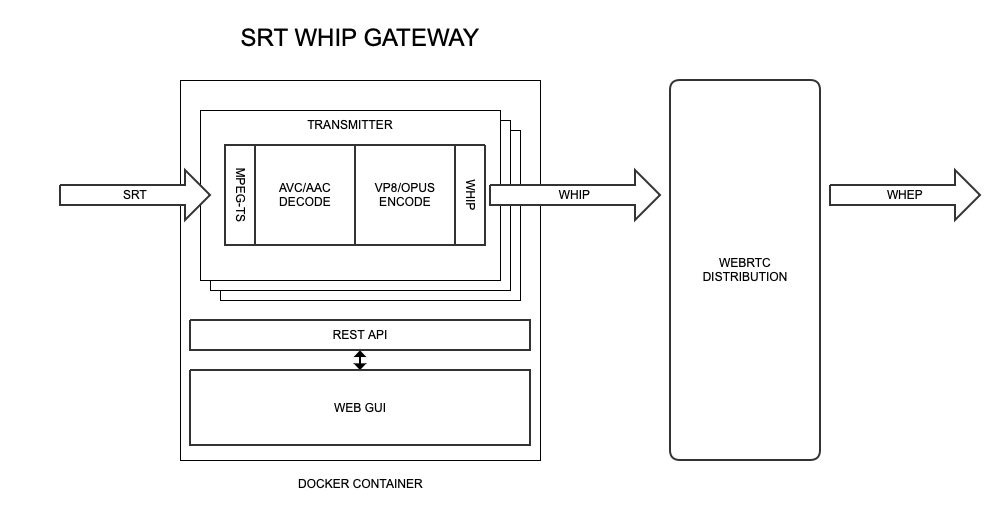
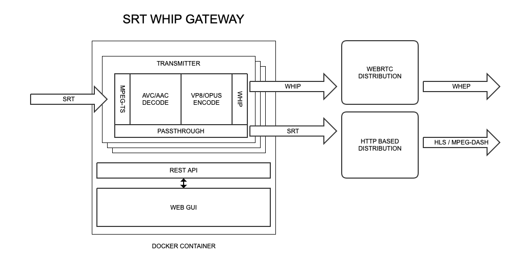

# SRT-WHIP GATEWAY
> *Open Source SRT WHIP Gateway*

[](http://slack.streamingtech.se)

A Docker container to receive MPEG-TS over SRT and stream to a WHIP compatible endpoint for WebRTC based broadcast distribution.



The receiving MPEG-TS can be restreamed to an SRT ingest endpoint for HTTP-based distribution in addition.



A transmitter is an SRT receiver and WHIP encoder based on the `whip-mpegts` [command line tool](https://github.com/Eyevinn/whip-mpegts). Each transmitter has an configured SRT port in listener mode and configured for a specific WHIP URL. The transmitters can be managed via the REST API or the Web GUI.


## Supported input and output formats

| IN (SRT/MPEG-TS)  | UDP (MPEG-TS) | SRT (MPEG-TS) | WHIP (SRTP) |
| ----------------- | ------------- | ------------  | ----------- |
| AVC/AAC           | AVC/AAC       | AVC/AAC       | VP8/OPUS    |
| HEVC/AAC          | HEVC/AAC      | HEVC/AAC      | VP8/OPUS    |

## Run SRT WHIP Gateway

To run the latest version of SRT WHIP Gateway.

```
docker run -d -p 3000:3000 -p 9000-9999:9000-9999/udp \
  eyevinntechnology/srt-whip
```

Run a specific version of SRT WHIP Gateway.

```
docker run -d -p 3000:3000 -p 9000-9999:9000-9999/udp \
  eyevinntechnology/srt-whip:<version number>
```

Once the container is up and running you can access the API at `http://localhost:3000/api/docs` and the Web GUI at `http://localhost:3000/ui`.

## Usage Guide

### Add a transmitter

To add a transmitter enter the `SRT Port` to listen to. If you have followed the above container running instructions you can choose a port number between 9000 and 9999. Then enter the `WHIP Url` to the WHIP endpoint you want to stream to. Then press `Add` button.

### Start transmitter

A green border indicates that the transmitter is `idle` and can be started. Click anywhere in the white area within the green border to start a transmitter. Once the transmitter is running the box will turn red to indicate that it is a running transmitter.

When the transmitter is running you can start your video software to stream to the designated SRT port that you have configured for this transmitter. The below `ffmpeg` command line illustrates an example.

```
ffmpeg -re -i video.mp4 -c:v libx264 -c:a aac -f mpegts srt://localhost:9191/
```

### Stop transmitter

To stop a running transmitter (indicated by red color) you click on the red area for the transmitter to stop.

### Remove transmitter

To remove a transmitter click on the X in the top right corner of the transmitter.

## Contributing

If you're interested in contributing to the project:

- We welcome all people who want to contribute in a healthy and constructive manner within our community. To help us create a safe and positive community experience for all, we require all participants to adhere to the [Code of Conduct](docs/CODE_OF_CONDUCT.md).
- If you are looking to make a code change first learn how to setup your local environment in our [Developer guide](docs/developer.md). Then create a Pull Request with suggested changes.
- Report, triage bugs or suggest enhancements.
- Help others by answering questions.

## License (Apache-2.0)

```
Copyright 2022 Eyevinn Technology AB

Licensed under the Apache License, Version 2.0 (the "License");
you may not use this file except in compliance with the License.
You may obtain a copy of the License at

    http://www.apache.org/licenses/LICENSE-2.0

Unless required by applicable law or agreed to in writing, software
distributed under the License is distributed on an "AS IS" BASIS,
WITHOUT WARRANTIES OR CONDITIONS OF ANY KIND, either express or implied.
See the License for the specific language governing permissions and
limitations under the License.
```

## Support

Join our [community on Slack](http://slack.streamingtech.se) where you can post any questions regarding any of our open source projects. Eyevinn's consulting business can also offer you:

- Further development of this component
- Customization and integration of this component into your platform
- Support and maintenance agreement

Contact [sales@eyevinn.se](mailto:sales@eyevinn.se) if you are interested.

## About Eyevinn Technology

[Eyevinn Technology](https://www.eyevinntechnology.se) is an independent consultant firm specialized in video and streaming. Independent in a way that we are not commercially tied to any platform or technology vendor. As our way to innovate and push the industry forward we develop proof-of-concepts and tools. The things we learn and the code we write we share with the industry in [blogs](https://dev.to/video) and by open sourcing the code we have written.

Want to know more about Eyevinn and how it is to work here. Contact us at work@eyevinn.se!